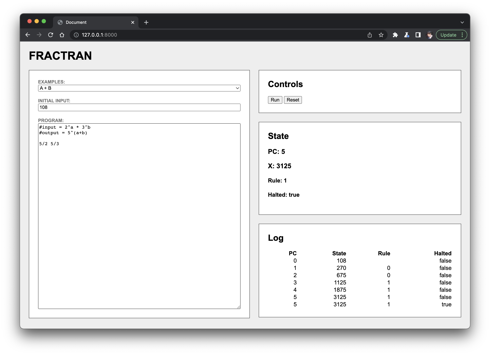

# FRACTRAN

Example FRACTRAN implimentation in javascript.

> FRACTRAN is a Turing-complete esoteric programming language invented by the mathematician John Conway. A FRACTRAN program is an ordered list of positive fractions together with an initial positive integer input n.


The program is run by updating the integer n as follows:

1. for the first fraction f in the list for which nf is an integer, replace n by nf
2. repeat this rule until no fraction in the list produces an integer when multiplied by n, then halt.

# Demo


# Running Demo
```
make run
```

# Example Programs

### A + B
```
input=2^a * 3^b
program=5/2 5/3
output=5^(a+b)
```

### | A - B |
```
input=2^a * 3^b
program=1/6 5/2 5/3
output=5^|A-B|
```

### A * B
```
input=2^a * 3^b
program=231/539 1/77 245/21 77/7 7/2 1/3
output=5^(a*b)
```

# More Info:
1. https://en.wikipedia.org/wiki/FRACTRAN
2. https://raganwald.com/2020/05/03/fractran.html
3. https://youtu.be/548BH-YFT1E